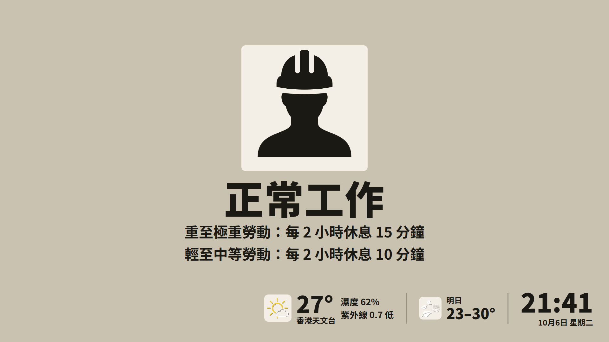
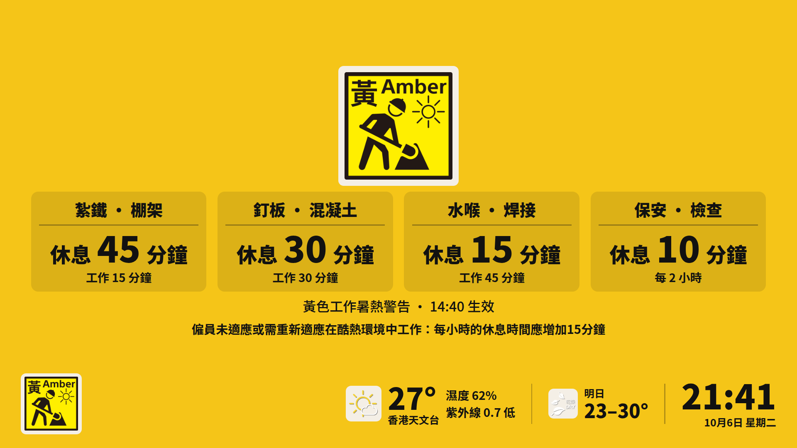
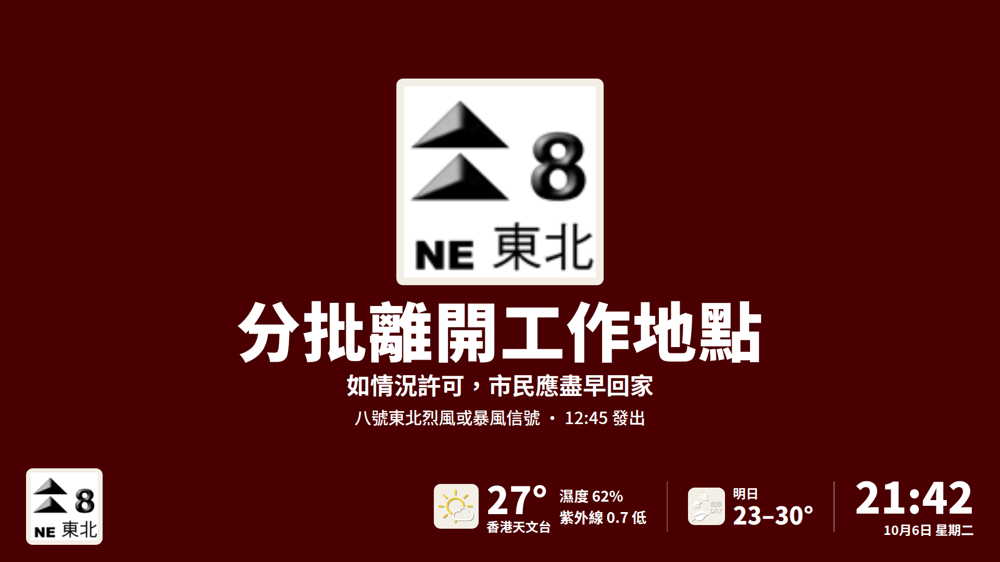
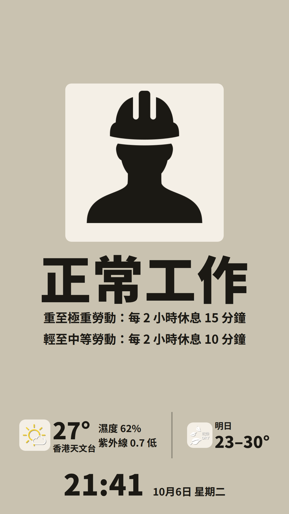

# hk-site-display

Hong Kong construction **site notice**: live Labour Department Heat Stress at Work Warning (HSWW) and HKO weather warnings on one screen at the gate.

Official HKO / Labour Department icons and wording only. Every state uses one centred layout, in landscape or portrait: a large official icon, the instruction, and a bottom bar with every warning in force, the temperature at the nearest HKO station, tomorrow's forecast and the clock. On heat-stress days the instruction becomes one tile per rest time, labelled with the site's trades. Not a 4S system. Not a sensor product.

## Live demo

| | |
|---|---|
| Live | https://hksite-display.loadingtechnology.app/ |
| Preview (switch cases; does not overlay live) | https://hksite-display.loadingtechnology.app/?preview=1 |
| Gallery (every official icon + case) | https://hksite-display.loadingtechnology.app/?gallery=1 |







Same URL, portrait:



Design and decisions: `docs/superpowers/specs/2026-10-06-gate-screen-upgrade-design.md`.

## Rules the notice will not break

- HSWW level comes only from `hkhi_icon.xml` `iconIndex` (30 amber / 32 red / 34 black). Never inferred from HKHI CSV or the title string.
- Rest minutes live in `config/rest_schedule.json` only (LD guidance Appendix 4; the indoor −15 minute adjustment reproduces Appendix 4(a)).
- Instruction text lives in `config/display_actions.json`, stored with the official sentence it comes from. `tests/test_display_actions.py` fails if a displayed fragment is not a verbatim part of its quote.
- Warning marks are official HKO/LD files. We do not draw substitute typhoon / rain / heat symbols.
- `GET /api/v1/snapshot` is always live. `POST /sim` is preview-only.

## Official sources (checked 2026-10-06)

- Labour Department 《預防工作時中暑指引》, 3rd edition (revised) Aug 2026: https://www.labour.gov.hk/common/public/oh/Heat_Stress_GN_tc.pdf
- Labour Department 《惡劣天氣及「極端情況」下的工作守則》, May 2026: https://www.labour.gov.hk/tc/public/pdf/wcp/Rainstorm.pdf
- HKO advice pages for tropical cyclone signals, rainstorms, landslips and tsunamis (URLs in `config/display_actions.json`)
- HKO Open Data API documentation: https://data.weather.gov.hk/weatherAPI/doc/HKO_Open_Data_API_Documentation.pdf

Re-check every April and whenever LD or HKO announce a revision (spec §9).

## Data sources

| Feed | Source | Refresh |
|---|---|---|
| HSWW | `https://www.hko.gov.hk/wxinfo/hkhi/hkhi_icon.xml` | 60 s |
| Warnings | HKO Open Data `warnsum` + `warningInfo` | 60 s |
| Current weather | HKO Open Data `rhrread` | 10 min |
| 9-day forecast | HKO Open Data `fnd` | 30 min |

Each feed is cached separately, and a failing feed keeps its last value.
- The screen shows 資料過期 when the warning feeds are more than 10 minutes old.
- It hides the weather after 90 minutes and the forecast after 12 hours.
- The notice refreshes `/api/v1/snapshot` every 30 s.

Icons: `apps/kiosk/public/official/` (see its README). Refresh them with `python3 scripts/fetch_official_icons.py`.

## Weather station and location

The temperature on the bottom bar comes from an HKO station, and the station's name is shown under it.

- The page asks the browser for the screen's location. If it is allowed, the screen shows the nearest HKO station that is reporting a temperature.
- With no location (refused, unavailable, too coarse to be useful, outside Hong Kong, or the page is plain `http://`, since browsers only allow location on `https://` and `localhost`), it shows 香港天文台, the general HKO reading. A site can name another fallback with `weatherStation`.
- The screen never waits for the browser's answer, and the location never affects warnings, rest times or wording.
- Humidity is shown only with 香港天文台, because that is the only station HKO reports it for.
- `?loc=0` on the URL stops the page asking, for a screen where nobody can answer the browser's prompt. Allow the location once when setting a screen up and the browser remembers it.

What is sent: the position rounded to about 1 km (`/api/v1/snapshot?lat=22.32&lon=114.22&acc=100`), only to choose the station. The service does not store it, and the access log shows `lat=-&lon=-&acc=-`. The screen keeps its last position in the browser's local storage so a reload shows the right station straight away.

Stations and coordinates are HKO's own (https://www.hko.gov.hk/en/cis/stn.htm). Refresh them with `python3 scripts/fetch_hko_stations.py` (`--check` only reports drift).

## Site config

`config/sites/demo-site.json`. Copy it, and do not commit real site names.

| Field | Meaning |
|---|---|
| `weatherStation` | HKO station shown when the screen has no location (default 香港天文台); must be a name in `config/hko_stations.json` |
| `environment` | `outdoor`, `indoor` (no air-conditioning) or `aircon`; the default for every trade |
| `restAdjustMinutes` | Employer's adjustment under LD guidance §5.3–5.5: a multiple of 15, from −30 to +60 |
| `defaultWorkload` | `light`, `moderate`, `heavy` or `very_heavy` |
| `primaryTrades[]` | `labelZh`, `workload`, and optional per-trade `environment` and `adjustMinutes` |

## Local run

Linux / macOS:

```bash
python3 -m venv .venv && .venv/bin/pip install pytest fastapi httpx uvicorn
.venv/bin/python -m uvicorn app.main:app --app-dir services/ingest --host 127.0.0.1 --port 8000
cd apps/kiosk && npm install && npm run dev
```

On Windows, use `.venv/Scripts/python.exe` in place of `.venv/bin/python`.

- http://localhost:5173/ — live fullscreen (the browser asks for the location; add `?loc=0` to skip it)
- http://localhost:5173/?preview=1 — fixture preview (add `&bar=0` to hide the buttons)
- http://localhost:5173/?gallery=1 — every official icon and signal case

Tests: `.venv/bin/python -m pytest tests -q`. Kiosk type-check and build: `cd apps/kiosk && npm run build`.

## Deploy

```bash
docker compose up --build -d
```

Open http://SERVER_IP/ (live). Do not commit `.env`, origin certificates, or real site names; copy `config/sites/demo-site.json`.
