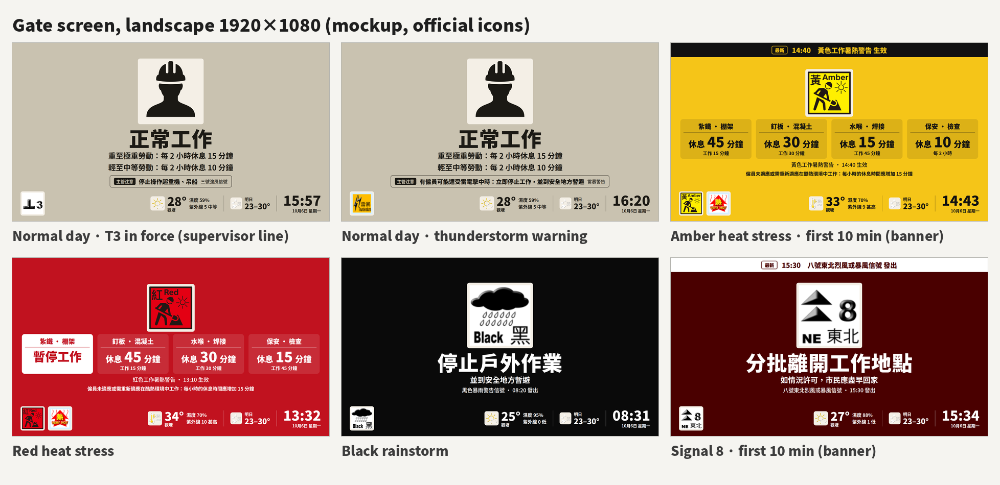
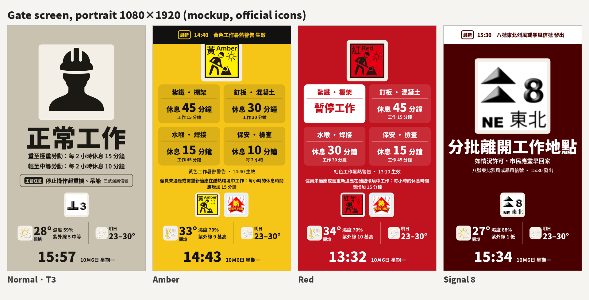

# Gate screen upgrade: design

- **Date:** 2026-10-06
- **Status:** Draft for review
- **Repo:** `loadingcloud001/hk-site-display` (branch `master`)
- **Scope:** sub-project A of the improvement roadmap. The worker phone page, admin and multi-site support, history and alerts are separate later sub-projects.

## 1. Goal

Make the gate screen **correct against the latest official guidance** and **more useful at a glance**:

1. Show heat-stress rest times **per trade**, not one workload level for the whole site.
2. Use the **exact official wording** for every instruction, traceable to a dated source.
3. Add the current **district weather** and **tomorrow's forecast**.
4. Show a **change banner** for 10 minutes when a warning is issued or cancelled.
5. Add a **supervisor line** for official instructions that apply only to some equipment or workers (cranes, gondolas, slope works, lightning-exposed work).
6. Keep **one centred layout** in every state, in both landscape (1920×1080) and portrait (1080×1920).

## 2. Non-goals

- The worker phone page (QR), admin settings, multiple sites or screens, warning history and export, push alerts, and sound.
- Languages other than Chinese. The screen is Chinese only; the English inside official icons stays as published.
- 「極端情況」 ("extreme conditions"). There is no machine-readable official feed for it (see §10).
- Inferring the heat-stress level from anything other than `iconIndex`. The existing rule stands.

## 3. Official sources (verified 2026-10-06)

Every rest number and every instruction on the screen must trace to one of these documents.

| Key | Document | Edition / date checked | URL |
|---|---|---|---|
| `ld-gn-heat` | 勞工處《預防工作時中暑指引》 / *Guidance Notes on Prevention of Heat Stroke at Work* | 3rd edition (revised), Aug 2026; PDF last modified 2026-08-27 | https://www.labour.gov.hk/common/public/oh/Heat_Stress_GN_tc.pdf (EN: `..._en.pdf`) |
| `ld-cop-weather` | 勞工處《惡劣天氣及「極端情況」下的工作守則》 | EN May 2026; TC PDF modified 2026-06-05 | https://www.labour.gov.hk/tc/public/pdf/wcp/Rainstorm.pdf (EN: https://www.labour.gov.hk/eng/public/wcp/Rainstorm.pdf) |
| `hko-tc` | 天文台《熱帶氣旋警告信號生效時應注意的事項》 | fetched 2026-10-06 | https://www.hko.gov.hk/tc/informtc/precaution.htm |
| `hko-rain` | 天文台《暴雨警告系統》 | fetched 2026-10-06 | https://www.hko.gov.hk/tc/wservice/warning/rainstor.htm |
| `hko-landslip` | 天文台《山泥傾瀉警告》 | fetched 2026-10-06 | https://www.hko.gov.hk/tc/wservice/warning/landslip.htm |
| `hko-thunder` | 天文台《雷暴警告》 | fetched 2026-10-06 | https://www.hko.gov.hk/tc/wservice/warning/thunder.htm |
| `hko-tsunami` | 天文台《香港海嘯的監測及警告》 | fetched 2026-10-06 | https://www.hko.gov.hk/tc/gts/equake/tsunami_mon.htm |
| `hko-api` | HKO Open Data API Documentation (EN and TC) | Sep 2025 | https://data.weather.gov.hk/weatherAPI/doc/HKO_Open_Data_API_Documentation.pdf |

### 3.1 Corrections this design makes

| # | Item | Current repo | Official source | Change |
|---|---|---|---|---|
| 1 | Zero hourly rest (e.g. Amber, light work) | 休息 0 分鐘 | `ld-gn-heat` 5.5.4: still give 輕至中等勞動 ≥10 min, 重至極重勞動 ≥15 min per 2 h worked | Baseline tile: 休息 10/15 分鐘 · 每 2 小時 |
| 2 | Workload label | 中勞動 | `ld-gn-heat` App. 1: **中等勞動** | Rename |
| 3 | Pre-8 caption | 預警八號熱帶氣旋警告信號 | `hko-api` TC: **預警八號熱帶氣旋警告信號之特別報告** | Full official name |
| 4 | Heat-stress update messages | (no banner yet) | `ld-gn-heat` 5.1.2 and App. 6: an hourly 「仍然生效」 update | Banner reacts to 生效 and 取消 only |
| 5 | Indoor work without air conditioning | Missing | `ld-gn-heat` App. 4(a): 15 min less rest | Add an `indoor` table |
| 6 | Rest adjustments | One site-level value | `ld-gn-heat` 5.3–5.5 | Per-trade `adjustMinutes`; +60 → 暫停工作 |
| 7 | Workers new to hot work | Not shown | `ld-gn-heat` 5.4.4: +15 min per hour | Note line on heat-stress days |
| 8 | Signal 8 | 留在室內 | `ld-cop-weather` App. 2(b); `hko-tc` | 分批離開工作地點 / 如情況許可，市民應盡早回家 |
| 9 | Pre-8 | 盡早返回有蓋處 + Icons8 hurricane | `ld-cop-weather` App. 2(b) | Same instruction as Signal 8; the hero icon is the official in-force signal icon |
| 10 | Signal 10 | 切勿離開有蓋處 | `hko-tc` | 切勿離開有遮蔽的地方 |
| 11 | Red rain | 暫停戶外工作 / 到安全地方暫避 | `hko-rain` | 暫停戶外作業 / 直至天氣情況許可為止 |
| 12 | Black rain | 暫停戶外工作 | `hko-rain` | 停止戶外作業 / 並到安全地方暫避 |
| 13 | Landslip | 遠離斜坡 | `hko-landslip`, `ld-cop-weather` | 避免靠近陡峭的斜坡和護土牆 / 停止操作起重機、吊船、進行斜坡工程 |
| 14 | Thunderstorm | No instruction | `ld-cop-weather` App. 2 | Supervisor line |
| 15 | T1/T3, Amber rain, monsoon | No instruction | `ld-cop-weather` App. 2 | Supervisor line |
| 16 | Signal 8 and Black rain both in force | Signal 8 outranks Black rain, so the screen would say 分批離開工作地點 | `hko-tc` T8 advice is conditional (**如情況許可**); `hko-rain` and `ld-cop-weather` say Black rain means stay in a safe place | Black rain outranks Signal 8 for the main instruction (§4.2) |

**Already correct, no change:** the outdoor rest table (`ld-gn-heat` App. 4) matches `config/rest_schedule.json` exactly; Signal 9's 切勿外出; the tsunami instruction 遠離岸邊; reading the heat-stress level from `iconIndex`.

## 4. Screen design

Mockups use the real official icons and are rendered at real size:





### 4.1 Layout (identical structure in every state)

From top to bottom:

1. **Banner area.** A full-width strip overlaid at the top, 8vh high in landscape and one line in portrait. It shows either the change banner (§4.7) or, when data is stale, the existing red stale strip. The centre area always reserves this height, so content never shifts when the banner appears.
2. **Centre**, everything centred horizontally:
   - the hero icon on a cream plate (`#f4efe6`);
   - the main instruction, or the trade tiles on heat-stress days;
   - zero to two sub lines;
   - a meta line (official warning name · time);
   - on heat-stress days, the note line; on normal and heat-stress days, up to two supervisor lines.
3. **Bottom bar.**
   - Left: the rail of every in-force warning icon, as today.
   - Right: the weather icon and district temperature (place name under it), humidity and UV, then tomorrow's icon and temperature range, then the clock and date.
   - Portrait stacks these as three rows: the rail; weather and tomorrow; the clock and date.

| Element | Landscape | Portrait |
|---|---|---|
| Hero icon (normal or weather state) | 34vh | min(28vh, 54vw) |
| Hero icon (heat-stress state) | 24vh | 14vh |
| Main instruction font | min(11.5vh, 88vw ÷ characters) | min(10vh, 92vw ÷ characters) |
| Rail (warning) icons | 12vh | 15vw |
| Weather icon | 7vh | 9vw |
| Forecast icon | 5.6vh | 7vw |
| Trade tiles | one row, ≤4 per row | 2 columns |

- **Icon size rule:** hero > warning icons > weather icon > forecast icon. Warning icons are always larger than information icons.
- **Long instructions:** the main instruction never wraps. Its font size shrinks with character count, so 分批離開工作地點 (8 characters) fits in portrait.
- **Font:** Noto Sans HK from Google Fonts (HK glyph standard), falling back to Microsoft JhengHei, then the system sans-serif. Weights 500, 700 and 900. Numbers use tabular figures.
- **Background colours** keep today's tones (`idle` clay, `amber`, `red`, `black`, `p0-tc`, `p0-rain`, `p0-landslip`, `p1`, `watch`).

### 4.2 States and precedence

Exactly one state applies at a time, decided in the backend:

1. **Weather state.** A warning in force has a main instruction in §4.4. If several apply, the first in this order wins:

   **TC10 > TC9 > WRAINB > TC8 (any direction) > WL > WTMW > WTCPRE8 > WRAINR**

   Instructions to stay sheltered outrank instructions to leave. HKO's T8 advice applies only 如情況許可 ("if conditions permit"), while Black rain tells people to stay in a safe place. Every other warning in force still appears in the rail.
2. **Heat-stress state.** The heat-stress warning is in force and no weather state applies.
3. **Normal state.** Otherwise.

Stale data does not change the state. It replaces the banner with the stale strip, as today. Background tones keep today's mapping: `p0-tc` for TC8/9/10, `p0-rain` for WRAINB, `p0-landslip` for WL, `p1` for WRAINR and WTCPRE8, `watch` for WTMW, and the heat-stress level colour in the heat-stress state.

### 4.3 Normal state

- Hero: the existing idle worker status mark (`status/work-ok.png`). It is not an official warning symbol, and the README already says so.
- Main: 正常工作.
- Sub lines come from `rest_schedule.json` → `baseline` (`ld-gn-heat` 4.7.1) for the workloads of the configured trades:
  - All trades heavy or very heavy: one line, 每 2 小時休息 15 分鐘.
  - All light or moderate: 每 2 小時休息 10 分鐘.
  - Mixed: two lines, 重至極重勞動：每 2 小時休息 15 分鐘 and 輕至中等勞動：每 2 小時休息 10 分鐘.
  - No trades configured: use the site's `defaultWorkload`.
- Supervisor lines: §4.5.

### 4.4 Weather state: official instructions

Each instruction is stored in `config/display_actions.json` together with the official sentence(s) it was taken from. **Every displayed fragment must be a contiguous substring of its quote** (§7.3).

| Code | Main | Sub | Quote (source) |
|---|---|---|---|
| TC8NE / TC8SE / TC8NW / TC8SW | 分批離開工作地點 | 如情況許可，市民應盡早回家 | 當八號預警（在預計發出八號信號前兩小時內發出）或八號信號發出，按預先協定分批離開工作地點或下班。(`ld-cop-weather`) · 如情況許可，市民應盡早回家，避免逗留在街上。(`hko-tc`) |
| WTCPRE8 | 分批離開工作地點 | — (the official name appears in the meta line) | the `ld-cop-weather` sentence above |
| TC9 | 切勿外出 | 如果已經在有遮蔽的地方躲避，就應該繼續留在原處 | 切勿外出。如果已經在有遮蔽的地方躲避，就應該繼續留在原處。(`hko-tc`) |
| TC10 | 切勿離開有遮蔽的地方 | 同時留意風向轉變 | 切勿離開有遮蔽的地方，同時留意風向轉變。(`hko-tc`) |
| WRAINB | 停止戶外作業 | 並到安全地方暫避 | 在空曠地方工作的人士應停止戶外作業，並到安全地方暫避。(`hko-rain`) |
| WRAINR | 暫停戶外作業 | 直至天氣情況許可為止 | 在空曠地方工作的人士應暫停戶外作業，直至天氣情況許可為止。(`hko-rain`) |
| WL | 避免靠近陡峭的斜坡和護土牆 | 停止操作起重機、吊船、進行斜坡工程 | 行人應避免靠近陡峭的斜坡和護土牆。(`hko-landslip`) · 在發出強烈季候風信號及山泥傾瀉警告時，應停止操作起重機、吊船、進行斜坡工程等工作。(`ld-cop-weather`) |
| WTMW | 遠離岸邊 | 前往內陸地方或地勢較高的地面 | 遠離岸邊、海灘及沿岸低窪地區。如身處這些地點，應前往內陸地方或地勢較高的地面。(`hko-tsunami`) |

- **Hero icon:** the official icon of the winning code. **WTCPRE8 uses the official icon of the tropical cyclone signal currently in force** (T1 or T3). `status/pre8.png` (Icons8) is removed from the screen and the gallery.
- **Meta line:** `{official warning name} · {HH:MM} 發出`. The name comes from warnsum `type`, or `name` when `type` is empty. The time comes from `issueTime`. For WTCPRE8, the name is 預警八號熱帶氣旋警告信號之特別報告 (`hko-api` TC) and the time comes from warningInfo `updateTime`.

### 4.5 Supervisor line

These official instructions apply only to some equipment or workers. They never replace the main instruction. They are shown **only in the normal and heat-stress states**, as at most **two lines**, most severe first. Each line has a 主管注意 label, the instruction, and the name of the warning that triggers it.

| Rank | Code(s) | Line text (fragments) | Quote (`ld-cop-weather` App. 2) |
|---|---|---|---|
| 1 | WTS | 有僱員可能遭受雷電擊中時 ： 立即停止工作，並到安全地方暫避 | 在雷暴警告生效期間及有僱員可能遭受雷電擊中時，主管應在切實可行範圍內盡量安排僱員立即停止工作，並到安全地方暫避。 |
| 2 | WMSGNL | 停止操作起重機、吊船、進行斜坡工程 | 在發出強烈季候風信號及山泥傾瀉警告時，應停止操作起重機、吊船、進行斜坡工程等工作。 |
| 3 | TC1, TC3 | 停止操作起重機、吊船 | 在一號或三號信號期間︰停止操作起重機、吊船等。 |
| 4 | WRAINA | 停止操作吊船、進行斜坡工程 | 在黃色或紅色暴雨警告期間︰停止操作吊船、進行斜坡工程等工作。 |

WRAINR and WL are weather states, so their supervisor instructions are covered by their own sub lines.

### 4.6 Heat-stress state: trade tiles

**Rest computation** happens in the backend, for each trade in `primaryTrades`. It follows the guidance's own method (`ld-gn-heat` 5.5.2): start from the Appendix 4 value, then apply adjustments.

1. `environment` is `outdoor`, `indoor` (no air conditioning) or `aircon`. `aircon` needs no hourly rest (`ld-gn-heat` footnote 4), so it goes straight to the baseline.
2. `rest = outdoor[level][workload].rest + environmentAdjust[environment] + adjustMinutes`.
   - `environmentAdjust` is 0 for outdoor and −15 for indoor (5.2.2, 5.3.1).
   - `adjustMinutes` is the trade's own value, or the site's `restAdjustMinutes`. It is a multiple of 15, from the employer's own assessment under §5.3–5.5 of the guidance.
3. Results:
   - `rest ≥ 60` → 暫停工作 (5.4.5).
   - `rest ≤ 0` → baseline: 10 minutes for light or moderate work, 15 for heavy or very heavy, per 2 hours (5.5.4).
   - Otherwise → rest per hour, and `work = 60 − rest`.

**Suspension cells** keep the hourly rest the two tables imply, so adjustments stay consistent with both appendices. Indoor is outdoor −15, and the tables step 15 minutes per workload level and per warning level. That gives Red very heavy and Black heavy 60, and **Black very heavy 75**: Appendix 4(a) still suspends it after the 15-minute indoor reduction, which only works from 75. A test rebuilds Appendix 4(a) cell by cell from `outdoor − 15`, so the encoding is checked against both official tables.

**Tiles:** trades with identical results share a tile.

- **Order:** 暫停工作 first, then descending hourly rest, then the baseline tiles (15, then 10).
- **Tile content, top to bottom:**
  - trade names joined with ` · `, maximum 3, then `+N`;
  - the big line: 休息 **45** 分鐘, with the number emphasised;
  - the small line: 工作 15 分鐘, or 每 2 小時 on a baseline tile.
- **暫停工作 tile:** a solid block in the reversed colours (stage text colour as background).
- **Hero icon:** the official heat-stress icon for the level (`iconRel`).
- **No trades configured:** one tile per workload level, labelled 輕勞動 / 中等勞動 / 重勞動 / 極重勞動, using the site's `environment` and `restAdjustMinutes`.
- **Count:** up to 6 tiles are possible (暫停, 45, 30, 15, baseline 15, baseline 10). Landscape uses one row when there are 4 or fewer, otherwise two rows of 3. Portrait uses 2 columns.

**Lines under the tiles:**

- Meta line: `{TitleTC} · {HH:MM} 生效`, where the time is the effective time parsed from `MessageTC2` (§4.7).
- Note line, always shown in this state: 僱員未適應或需重新適應在酷熱環境中工作：每小時的休息時間應增加 15 分鐘 (`ld-gn-heat` 5.4.4). In portrait it may wrap to two lines.
- Supervisor lines: §4.5.

### 4.7 Change banner

**Triggers.** An event fires the banner if its time is within the last 10 minutes:

| Source | Event | Time used | Banner text |
|---|---|---|---|
| HSWW | `MessageTC2` contains 生效 but not 仍然生效 (Issue) | effective time | `{TitleTC} 生效` |
| HSWW | `MessageTC2` contains 取消 (Cancel) | effective time | `工作暑熱警告 取消` |
| warnsum | `actionCode = ISSUE` | `issueTime` | `{type or name} 發出` |
| warnsum | `actionCode = CANCEL` | `updateTime` | `{type or name} 取消` (WTCSGNL with code `CANCEL` → 熱帶氣旋警告信號 取消) |
| warningInfo | `WTCPRE8` appears | `updateTime` | 預警八號熱帶氣旋警告信號之特別報告 發出 |

- **Never triggers:** HSWW updates (仍然生效, sent hourly), and `REISSUE`, `EXTEND` and `UPDATE`.
- **Effective time:** parsed from `MessageTC2` with `([上中下])午\s*(\d{1,2})\s*時\s*(?:(\d{1,2})\s*分|正)?`, converted to 24-hour HKT. If parsing fails, use the message time `date` (`YYYYMMDDHHMM`, HKT).
- **Content:** a 最新 tag, `HH:MM`, and the banner text. Colours are inverted relative to the stage.
- **Several events:** show the most severe (`code_rank`, with HSWW ranked by level). Ties go to the newest.
- **Stale data:** the banner is hidden and the stale strip shows instead.
- **Stateless:** the banner is a pure function of the feed data and `now`, so it survives restarts and every screen agrees.

### 4.8 Weather strip and forecast

- **Current weather** (rhrread, `lang=tc`):
  - The icon is `icon[0]` → `official/wxicon/pic{code}.png`.
  - Temperature comes from the station nearest the screen's position, else the site's `weatherStation`, else 香港天文台; the place name is always shown (see `2026-10-06-weather-station-by-location-design.md`).
  - Humidity is shown only next to 香港天文台, the only station HKO reports it for.
  - UV shows `value` and `desc` from 京士柏 (e.g. 紫外線 5 中等). It is hidden when the feed returns an empty string, for example at night.
- **Tomorrow** (fnd, `lang=tc`): the first `weatherForecast` entry with `forecastDate` later than today (HKT). It shows `ForecastIcon`, `forecastMintemp` and `forecastMaxtemp` as 明日 23–30°.
- **Freshness:** hide the weather block if rhrread `updateTime` is more than 90 minutes old. Hide the forecast if fnd `updateTime` is more than 12 hours old.

### 4.9 Official icons

- Add HKO's **100×100 PNG warning symbols** (`https://www.hko.gov.hk/images/HKOWarningSymbols/`) for TC1, TC3, TC8NE/NW/SE/SW, TC9, TC10, WRAINA, WRAINR and WRAINB under `official/warning/`. Point `config/official_icons.json` at them.
- Every other warning keeps its 58 px official GIF, the only size HKO publishes.
- Add the full HKO weather icon set (`https://www.hko.gov.hk/images/HKOWxIconOutline/pic{50–93}.png`, including night codes 70–77) under `official/wxicon/`.
- Update `official/README.md` with all three source folders.
- Scale with the browser's default smoothing. `pixelated` was tested and looks worse.

## 5. Data and backend

### 5.1 Feeds and caching

| Feed | URL | Poll | Stale after |
|---|---|---|---|
| HSWW | `https://www.hko.gov.hk/wxinfo/hkhi/hkhi_icon.xml` (JSON body) | 60 s | 10 min (warnings) |
| warnsum | `https://data.weather.gov.hk/weatherAPI/opendata/weather.php?dataType=warnsum&lang=tc` | 60 s | 10 min (warnings) |
| warningInfo | same endpoint, `dataType=warningInfo&lang=tc` | 60 s | 10 min (warnings) |
| rhrread | same endpoint, `dataType=rhrread&lang=tc` | 10 min | 90 min (weather block hidden) |
| fnd | same endpoint, `dataType=fnd&lang=tc` | 30 min | 12 h (forecast hidden) |

- **Per-feed cache.** Each feed has its own `{value, fetchedAt, ok}`. A failed fetch keeps the last good value. One feed failing never blocks the others.
- **Request path.** The poller is the only fetcher. `GET /api/v1/snapshot` builds the snapshot from the caches. If the caches are empty at cold start, it does one synchronous fetch.
- **Stale flag.** `stale` (warnings) is true when HSWW or warnsum is older than `STALE_AFTER_SEC`, as today.
- **Lifespan.** Replace the deprecated `@app.on_event("startup")` with a FastAPI lifespan handler.

### 5.2 Config changes

**`config/sites/demo-site.json`.** Demo trades follow the examples in `ld-gn-heat` App. 1.

```json
{
  "siteId": "demo-kai-tak",
  "nameZh": "示範地盤",
  "environment": "outdoor",
  "restAdjustMinutes": 0,
  "defaultWorkload": "very_heavy",
  "primaryTrades": [
    { "id": "bar-fixer",   "labelZh": "紮鐵",   "workload": "very_heavy" },
    { "id": "scaffolder",  "labelZh": "棚架",   "workload": "very_heavy" },
    { "id": "formwork",    "labelZh": "釘板",   "workload": "heavy" },
    { "id": "concreter",   "labelZh": "混凝土", "workload": "heavy" },
    { "id": "plumber",     "labelZh": "水喉",   "workload": "moderate" },
    { "id": "welder",      "labelZh": "焊接",   "workload": "moderate" },
    { "id": "security",    "labelZh": "保安",   "workload": "light" },
    { "id": "inspector",   "labelZh": "檢查",   "workload": "light" }
  ]
}
```

Optional fields on each trade:

- `environment`: `outdoor` | `indoor` | `aircon`. Defaults to the site's `environment`.
- `adjustMinutes`: a multiple of 15. Defaults to `restAdjustMinutes`.

**`config/rest_schedule.json`.**

- Keep `outdoor` (App. 4), verified, with one change: Black `very_heavy` stores `"rest": 75` (still `"suspend": true`), for the reason in §4.6.
- Add `environmentAdjust`: `{"outdoor": 0, "indoor": -15}` (5.2.2, 5.3.1).
- Add `baseline` from 4.7.1: `light` and `moderate` 10 min, `heavy` and `very_heavy` 15 min, `perHours: 2`.
- Add `_notes` citing the sources and explaining the 75.

The test expects Appendix 4(a) (indoor, no air conditioning) exactly, cell by cell:

| | Light | Moderate | Heavy | Very heavy |
|---|---|---|---|---|
| Amber | — | — | 45 work / 15 rest | 30 / 30 |
| Red | — | 45 / 15 | 30 / 30 | 15 / 45 |
| Black | 45 / 15 | 30 / 30 | 15 / 45 | Suspend |

"—" means no hourly rest, so the baseline applies.

Numbers stay only in this file (AGENTS.md rule).

**`config/wx_icons.json` (new).** The 29 HKO weather icon codes that exist (50–54, 60–65, 70–77, 80–85, 90–93), each with its official Chinese name from HKO's icon page (https://www.hko.gov.hk/textonly/v2/explain/wxicon_c.htm). The backend only emits icon paths for listed codes. The gallery uses these names, which also fixes three wrong labels in the repo today: pic50 is 陽光充沛 (not 天晴), pic62 is 微雨 (not 間有驟雨), and pic90 is 熱 (not 炎熱).

**`config/display_actions.json`.** Restructured. The shape is shown with one entry per section:

- `sources` holds one entry per key in §3.
- `weather` holds every row of §4.4.
- `supervisor` holds every row of §4.5.

```json
{
  "sources": {
    "hko-rain": {
      "titleZh": "天文台《暴雨警告系統》",
      "edition": "網頁版本（2026-10-06 查閱）",
      "url": "https://www.hko.gov.hk/tc/wservice/warning/rainstor.htm",
      "checked": "2026-10-06"
    }
  },
  "weather": {
    "WRAINB": {
      "main": "停止戶外作業",
      "sub": ["並到安全地方暫避"],
      "quotes": [{ "source": "hko-rain", "text": "在空曠地方工作的人士應停止戶外作業，並到安全地方暫避。" }]
    }
  },
  "supervisor": {
    "thunderstorm": {
      "rank": 1,
      "codes": ["WTS"],
      "fragments": ["有僱員可能遭受雷電擊中時", "立即停止工作，並到安全地方暫避"],
      "quotes": [{ "source": "ld-cop-weather", "text": "在雷暴警告生效期間及有僱員可能遭受雷電擊中時，主管應在切實可行範圍內盡量安排僱員立即停止工作，並到安全地方暫避。" }]
    }
  },
  "notes": {
    "heatUnacclimatised": {
      "fragments": ["僱員未適應或需重新適應在酷熱環境中工作", "每小時的休息時間應增加15分鐘"],
      "quotes": [{ "source": "ld-gn-heat", "text": "若僱員未適應或需重新適應在酷熱環境中工作，例如以往未曾或超過兩星期不曾在酷熱的環境中工作，僱主除了須跟從第4.6章有關熱適應期的安排外，當工作暑熱警告生效時，有關僱員每小時的休息時間應增加15分鐘。" }]
    }
  }
}
```

Multi-fragment lines (supervisor lines and the note) are displayed as `fragment1：fragment2`. The colon is the only character that isn't a verbatim quote.

**Config validation** at startup; a violation fails loudly:

- `adjustMinutes` and `restAdjustMinutes` are multiples of 15 between −30 and +60.
- `workload` is one of the four official levels.
- `environment` is `outdoor`, `indoor` or `aircon`.
- Every `display_actions` quote names a known source.

**Code constants.**

- `WORKLOAD_ZH["moderate"]` becomes 中等勞動.
- `PRE8_CAPTION` becomes 預警八號熱帶氣旋警告信號之特別報告.

### 5.3 Snapshot additions

All additions are additive: existing fields stay, so the deployed screen keeps working until the new frontend ships.

```text
display.mode        "normal" | "heat" | "weather"
display.main        string                (weather / normal)
display.sub         string[]              (0–2 lines)
display.meta        string | null
display.heroRel     string | null         (official icon; WTCPRE8 → in-force TC icon)
restTiles           [{kind: "suspend"|"rest"|"baseline", rest, work, perHours, trades: string[]}]
notes               string[]              (heat state: unacclimatised line)
supervisor          [{text: string, fromZh: string}]   (0–2)
banner              {time: "HH:MM", textZh, kind: "issue"|"cancel"} | null
weather             {iconRel, tempC, placeZh, humidity, uvValue, uvDescZh, updatedAt} | null
forecast            {date, iconRel, minC, maxC} | null
```

The legacy fields `display.action` and `display.actionSub` are still filled in, for backward compatibility.

### 5.4 Frontend

- `present.ts` stops duplicating priority sets and reads `display.mode` and the new fields.
- `Kiosk.tsx` renders the layout in §4. The gallery renders the same component scaled down.
- New Preview and Gallery cases:
  - a banner case for each source;
  - mixed-trade Amber, Red and Black;
  - indoor and aircon trades;
  - the supervisor line for T3, thunderstorm and monsoon;
  - Pre-8 with the T3 icon;
  - weather stale and forecast stale.
- Sim cases pass a fixed `now` so banners render deterministically.

### 5.5 Docs

- `AGENTS.md`: add the rule that instruction text must be a verbatim fragment of a quote in `display_actions.json`, and the re-verification checklist (§9).
- `README.md`:
  - list the §3 sources with their editions;
  - document the new site config fields;
  - add Linux local-run commands (`.venv/bin/python`) next to the Windows ones.
- `apps/kiosk/public/official/README.md`: list the three official icon folders. Drop the Pre-8 Icons8 entry from `status/README.md`.

## 6. Failure handling

| Failure | Behaviour |
|---|---|
| HSWW or warnsum fetch fails | Keep the last value; the stale strip appears after 10 min (today's rule) |
| warningInfo fails | Keep the last value; Pre-8 detection uses the cached data |
| rhrread fails or is >90 min old | Hide the weather block; nothing else changes |
| fnd fails or is >12 h old | Hide the forecast |
| A station has no reading in rhrread | Use the next candidate (nearest station, then the site's `weatherStation`, then 香港天文台) and show its name |
| Unknown weather icon code | Hide the icon, keep the numbers |
| UV empty string | Hide UV |
| Effective time can't be parsed | Use the message time `date` |
| Unknown warning code | Rail icon if an official icon exists, otherwise not shown (today's behaviour) |
| More than 6 tile groups | Impossible by construction; assert in tests |

## 7. Testing

### 7.1 Backend (pytest)

- **Rest computation:** Amber, Red and Black × all workloads × `outdoor`, `indoor` and `aircon`. Baseline when rest ≤ 0. Suspend when rest ≥ 60. Per-trade overrides of `adjustMinutes` and `environment`.
- **Grouping:** tile order, trade-name truncation with `+N`, and the fallback when no trades are configured.
- **Banner:**
  - HSWW Issue, Update (no banner) and Cancel classification;
  - warnsum ISSUE and CANCEL, with REISSUE, EXTEND and UPDATE ignored;
  - WTCSGNL `CANCEL`;
  - Pre-8;
  - the 10-minute edges (9:59 shows, 10:01 doesn't);
  - severity ordering;
  - hidden when stale.
- **Effective-time parser:** 上午, 中午, 下午, 正, and the fallback to `date`.
- **Weather:** station fallback, empty UV, unknown icon, 90-minute expiry. **Forecast:** picks the first future date; 12-hour expiry.
- **Precedence:** state selection (weather over heat over normal), the full weather order in §4.2 (including Black rain over Signal 8), and supervisor ranking capped at 2.
- **Config validation:** bad `adjustMinutes`, workload, environment or source key each raise.
- **Feed isolation:** one feed raising never breaks the snapshot. The three tests in `test_live_api.py` are rewritten against the per-feed cache with the same behaviours: the snapshot stays live after a sim POST; it is stale when the warnings feeds are older than 10 min; a transient failure keeps a fresh cache not stale.

### 7.2 Frontend

CI adds `npm ci && npm run build` in `apps/kiosk`. The build runs `tsc --noEmit` before `vite build`.

### 7.3 Wording guard

A test loads `display_actions.json` and asserts that every `main`, every `sub` line, every supervisor fragment and every note is a **contiguous substring of at least one of its quotes**, ignoring whitespace. It also asserts that every quote names a key that exists in `sources`. This stops paraphrased wording from creeping back in.

### 7.4 Visual check

Render each Preview case at 1920×1080 and 1080×1920 with headless Chrome, then review the images before release:

```bash
google-chrome --headless=new --window-size=1920,1080 --screenshot=out.png "http://localhost:5173/?preview=1&fixture=amber"
```

## 8. Rollout

1. Deploy the ingest changes; the snapshot is backward-compatible.
2. Deploy the kiosk; it reads the new fields.
3. Check the live screen in both orientations.
4. During the first real heat-stress warning after deploy, confirm the live `iconIndex` values (30/32/34) still match, since the 2026 trigger changes made the warning issuable from the Extremely Hot Weather special alert.

## 9. Re-verification checklist

Run this each April, before the hot season, and whenever LD or HKO announce revisions:

1. Re-download the two LD PDFs and compare edition, App. 1, App. 4, App. 4(a), §4.7.1, §5.4.4, §5.5.4 and App. 6 with `rest_schedule.json` and `display_actions.json`.
2. Re-read the HKO advice pages in §3 and update the quotes. The wording-guard test then forces matching screen text.
3. Update `sources[*].checked` dates.
4. Run `python3 scripts/fetch_hko_stations.py --check`. It compares `config/hko_stations.json` with HKO's station page and reports any station in the live weather report that has no coordinates yet.

## 10. Known gaps (later sub-projects)

- **「極端情況」:** announced by the government with no machine-readable official feed. It needs a manual switch, which belongs with the admin tools in sub-project C.
- **Special Landslip Advisory and Localised Heavy Rain Advisory** aren't in the HKO warnsum API, so the screen can't show them.
- The **unacclimatised +15 min** applies per person, so it is shown as a note rather than applied to the tiles.
